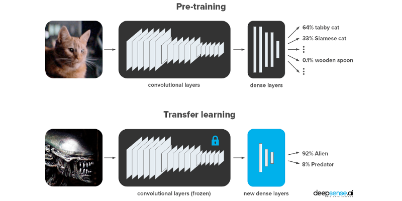

## Building an Automated Diagnosis Model with Transfer Learning
----
In this project we retrain the 'inception v3' image classifier on the pneumonia dataset using Tensorflow+Keras.

### Notes:
---
- I create this notebook in Linux WSL on Windows10. I have Ubuntu 18.04 LTS
- I uploaded a sample file, so you can run the notebook, but the full dataset is in Kaggle here: [https://www.kaggle.com/paultimothymooney/chest-xray-pneumonia](https://www.kaggle.com/paultimothymooney/chest-xray-pneumonia)
- The code runs, and with more time it could be cleaned up some more.

### Acknowledgement:
The code was based on [anjanatiha](https://github.com/anjanatiha/Pneumonia-Detection-from-Chest-X-Ray-Images-with-Deep-Learning/blob/master/code/Detection%20of%20Pneumonia%20from%20Chest%20X-Ray%20Images%201.0.0.3.ipynb) github's repo